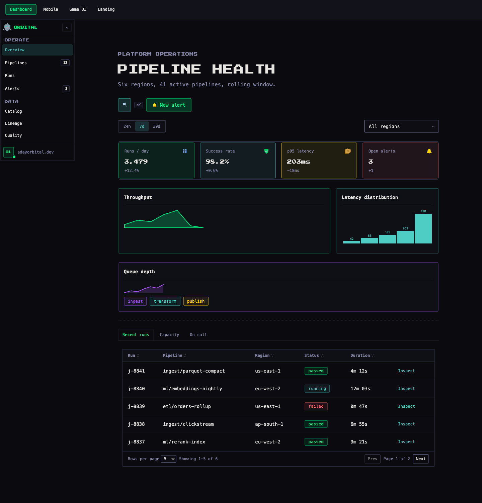
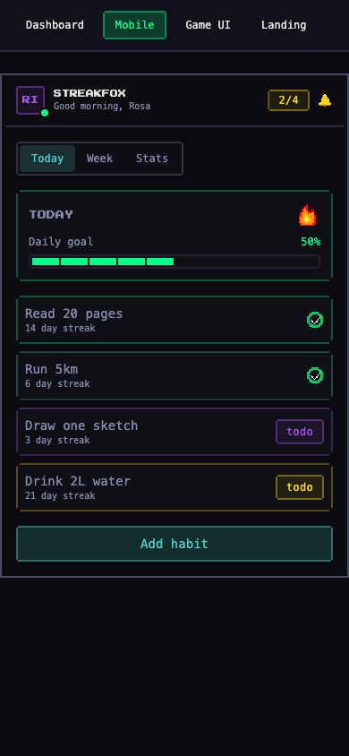
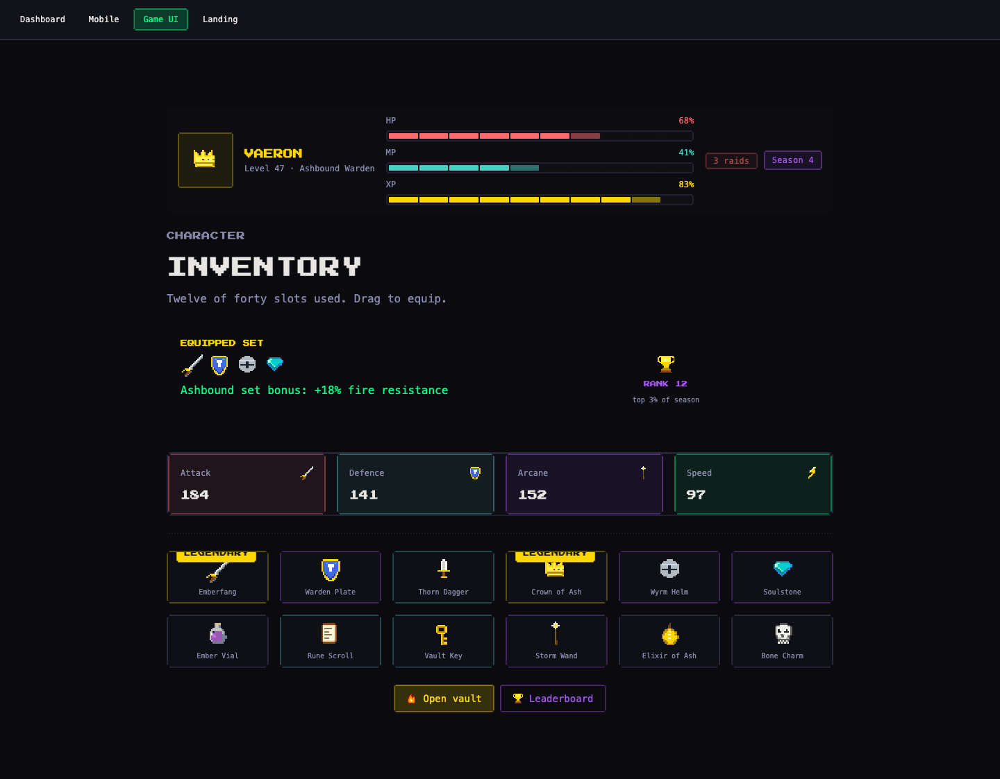
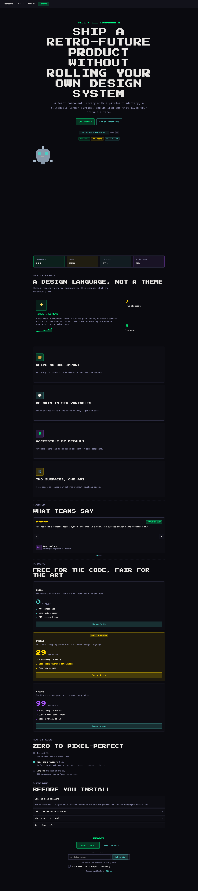
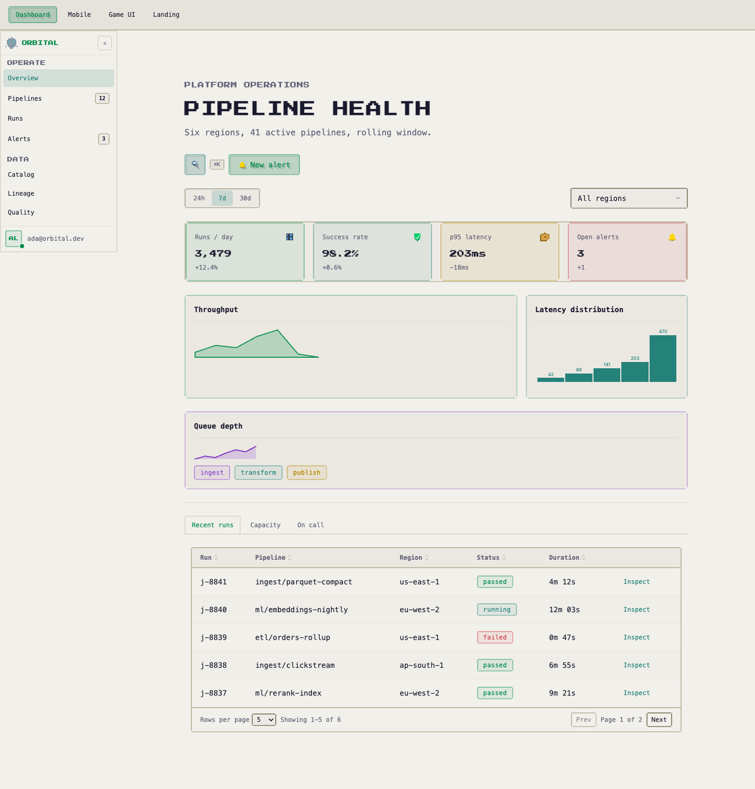

# pxlkit skills — real-world demos

What the pxlkit Claude Code skills actually produce, on a real project, with the
prompts that produced it and the numbers each result was measured against.

Everything here was run end to end on 2026-08-09 against `@pxlkit/ui-kit@2.1.1`
installed from npm — not against the monorepo, so the experience matches what an
outside user gets. The screenshots are unretouched captures of the built output.

**Read the failures too.** The value of a generator is not that it never gets
anything wrong; it is that the wrong things get caught before you see them. Each
section below records what the gates rejected and why, including two layout bugs
that compiled cleanly and passed every static check.

---

## The project under test

| | |
|---|---|
| Stack | Vite 6 · React 19 · TypeScript 5.7 · Tailwind v4 |
| Kit | `@pxlkit/ui-kit@2.1.1` from npm, with `core`, `ui`, `feedback`, `gamification`, `social` |
| Archetypes | operations dashboard · mobile app · game UI · marketing landing |
| Result | 63 distinct kit components across all 12 categories, 20 of them ones no shipped template uses |

---

## Step 0 — `/pxlkit:start` on an unprepared project

The project deliberately began with React and nothing else: no Tailwind, no kit.

**Prompt**

```
/pxlkit:start
```

**What happened.** The preflight refused to continue, with exit code 2:

```
pxlkit preflight — /tmp/pxlkit-demo
  framework:       unknown
  package manager: npm
  @pxlkit/ui-kit:  not installed

BLOCKERS — this project cannot use pxlkit as it stands:
  ✗ tailwindcss is not a dependency. The kit's styles.css is not self-contained —
    it starts with `@import "tailwindcss"` and defines an `@theme`, so it needs a
    Tailwind v4 pipeline to compile. Add Tailwind v4 first.
```

This is the behaviour the design insists on. The stylesheet genuinely cannot compile
without a Tailwind v4 build, so proceeding would have produced components that render
as unstyled boxes with nothing in the console to explain it. The skill names the
cause instead of guessing.

After installing Tailwind v4 and the kit, the same command reported the project as
ready and applied the Vite variant of the setup recipe: the `@source` directive, the
three providers, the fonts, and the inline anti-FOUC script that sets the theme class
before React mounts.

### What this step got wrong

The setup reference did not mention `@types/react`. On a TypeScript project that
produces a wall of `TS7016: Could not find a declaration file for module 'react'` at
the first typecheck — noise that buries the real errors. Fixed in the generator.

---

## Demo 1 — Operations dashboard

**Prompt**

```
/pxlkit:imagine an operations dashboard for a data platform: pipeline health across
regions, throughput and latency charts, a runs table with statuses, a command
palette, and an inspect drawer. Dense, dark, cyan and green.
```



**Gates**

| Gate | Result |
|---|---|
| G1 types | PASS — `tsc --noEmit` exit 0 |
| G2 build | PASS — exit 0, 52 modules |
| G3 runtime | PASS — no console errors from the kit (one 404 for a missing `favicon.ico`, a scaffold artefact) |
| G4 diversity | PASS — 28 components / 20 required · 8 categories / 6 · 7 underused / 2 |
| G5 token purity | PASS — no raw palette classes, no inline hex |
| G8 setup | PASS |

**What it used.** `PixelSidebar` with collapsible sections and badges, `PixelStatGroup`
with four toned `PixelStatCard`s, `PixelAreaChart` and `PixelBarChart`, `PixelSparkline`,
a `PixelDataTable` with pagination and status badges rendered per row, `PixelTabs`,
`PixelCommand` as a ⌘K palette, `PixelDrawer` for row inspection, `PixelSegmented` and
`PixelSelect` for filters, `PixelAvatarGroup` for the on-call rota.

---

## Demo 2 — Mobile app

**Prompt**

```
/pxlkit:imagine a mobile habit tracker at 390px: today / week / stats tabs, habit
cards with streaks, a bottom sheet to add a habit, and a progress ring for the daily
goal. Warm, playful, gamified.
```



**Gates**

| Gate | Result |
|---|---|
| G1 types | PASS |
| G2 build | PASS |
| G3 runtime | PASS |
| G4 diversity | PASS — 21 / 12 · 8 categories / 5 · 6 underused / 1 |
| G5 token purity | PASS |

**Worth noting.** At a 390px viewport nothing overflows horizontally and the touch
targets stay full-width. `PixelSheet` with `dragHandle` gives the bottom-sheet
interaction without any custom code, and `PixelSegmented` reads as a native iOS-style
tab switch while still being a radio group underneath.

---

## Demo 3 — Game UI

**Prompt**

```
/pxlkit:imagine an RPG character screen: HP/MP/XP bars, an inventory grid of twelve
items with rarity tiers, an equipped-set panel, and an item detail modal. Make the
legendary items obvious. Gold and purple, heavy pixel treatment.
```



**Gates**

| Gate | Result |
|---|---|
| G1 types | PASS |
| G2 build | PASS |
| G3 runtime | PASS |
| G4 diversity | PASS — 23 / 12 · 8 categories / 5 · 8 underused / 1 |
| G5 token purity | PASS |
| G6 visual | PASS after two fixes — see below |

### The two bugs the visual gate caught

Both compiled. Both passed every static gate. Neither would have been found without
looking at a screenshot, which is the entire argument for that gate existing.

**`PixelRibbon` wrapped around a card removes it from the grid.** The first attempt
wrapped legendary items in `<PixelRibbon>` to mark them. The ribbon is positioned
decoration, so wrapping a grid child pulled it out of flow: "Crown of Ash" floated to
the top-right corner of the *page*, and "Emberfang" vanished entirely. Ten of twelve
items rendered, and nothing anywhere reported a problem.

The fix is the canonical one — `PixelCard` takes a `badge={{ label, tone }}` prop for
exactly this. The rule now lives in the audit skill.

**A 2×2 bento cell beside four tiny ones produces dead space.** The stats bento put a
large "equipped set" cell next to four small stat cells. The small cells stretched to
the tall row's height, leaving roughly 200px of empty background mid-page. Bento
hierarchy works between blocks of *comparable* weight; a big block next to four
minimal ones is a job for a `PixelStatGroup` underneath, which is what it became.

**A looping `PixelGlitch` on a proper noun makes it unreadable.** The character name
was mid-glitch in the capture and rendered as fragments. Switched to
`trigger="hover"`: the effect on demand, the name legible at rest.

---

## Demo 4 — Marketing landing

**Prompt**

```
/pxlkit:imagine a landing page for the kit itself: hero with install command,
feature bento, pricing tiers, testimonials carousel, FAQ, and a newsletter signup.
```



**Gates**

| Gate | Result |
|---|---|
| G1 types | PASS |
| G2 build | PASS |
| G3 runtime | PASS |
| G4 diversity | PASS on the second attempt — 30 / 25 · 8 categories / 8 · 3 underused / 3 |
| G5 token purity | PASS |

### The diversity gate rejected the first version, correctly

First attempt: **25 components (exactly the floor), 7 of 8 categories, 1 of 3
underused — FAIL.**

The page was a competent marketing page that never touched `forms` and reached for
nothing beyond the obvious. The floors are calibrated from the repo's own
`landing-full-template`, which manages 27 components across 8 categories, so failing
meant the generated page was measurably thinner than the hand-written reference.

The fix was not to lower the bar. A newsletter signup added a real `forms` section
(`PixelInput` with an `addonRight` button, `PixelCheckbox`), a "zero to pixel-perfect"
`PixelTimeline` replaced a paragraph, and a `PixelKbd` joined the install chip.
Every addition earns its place. Second run: 30 components, 8 categories, 3 underused.

This is what "floors with a justifiable exception" is supposed to feel like — the gate
pushed the page toward using more of the system, and the page got better rather than
padded.

---

## Light mode

Dark is the kit's home, but the checklist requires both. Same dashboard, `.light`
class on `<html>`:



---

## What the run says about the skills

**The measurable gates work.** They rejected a thin landing page, a broken grid and a
dead-space layout, and each rejection produced a better result rather than a
workaround.

**The prop digest was the weak point.** The component digest carries names,
descriptions, highlights and relationships, but no prop signatures — the repo has no
props extractor for `props: 'auto'` to reuse, so the generator could not emit them.
Writing these four pages produced roughly 90 type errors on the first pass, almost all
of them prop-shape guesses: `gap` is numeric rather than `"sm" | "md"`, `PixelChip`
takes `label` rather than children, `PixelIconButton` takes `icon` and `label` rather
than children, `PixelContainer` uses `maxWidth` not `size`, `PixelGrid` uses `cols`
not `columns`, `useToast()` returns `{ toast }` rather than the toast itself.

Every one was caught by `tsc` in seconds, so none reached the screenshots. But an
agent that has to discover the API by compiling is slower than one that is told, and
the honest conclusion is that **the digest should carry prop signatures** — read from
the installed package's `.d.ts`, which is where the answers actually were.

**Numbers from the whole run**

| | |
|---|---|
| Distinct kit components used | 63 |
| Categories covered | 12 of 12 |
| Underused components reached for | 20 |
| Raw palette classes / inline hex | 0 |
| Type errors in final state | 0 |
| Console errors from the kit | 0 |
| Bundle | 591 KB JS, 92 KB CSS (unsplit, four full pages) |

---

## Reproducing this

The demo project is not committed — it is a scratch project built from npm packages,
and keeping it in the repo would mean maintaining a fifth app. To rebuild it:

1. `npm create vite@latest my-demo -- --template react-ts`
2. `npm install tailwindcss@^4 @tailwindcss/vite@^4 @pxlkit/ui-kit @pxlkit/core`
3. `/pxlkit:start` — applies the setup for your framework and package manager
4. Any of the four prompts above
5. `/pxlkit:audit --visual` — the same gates reported here
